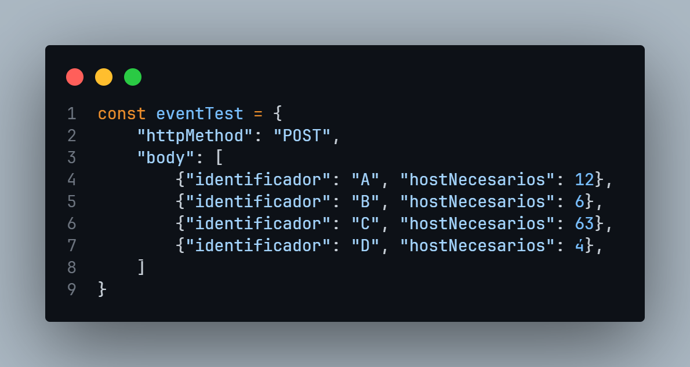
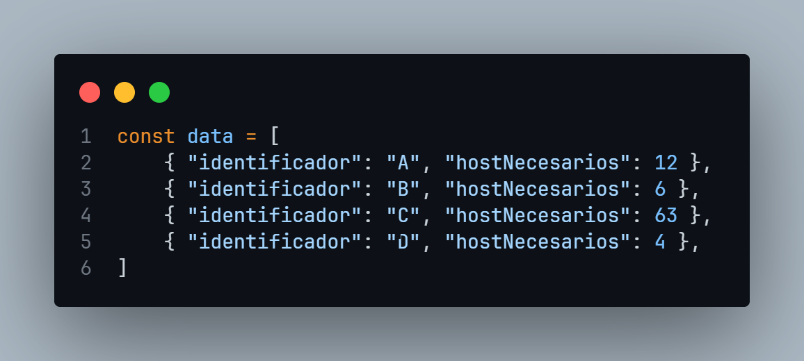
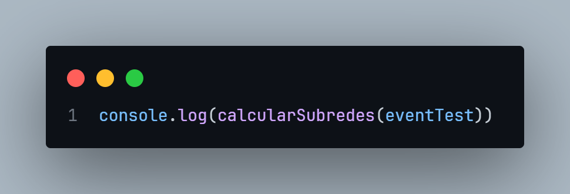

# Calculadora de subredes para IPV4

Este pequeño script es un programa escrito en JavaScript que te permitirá calcular subredes según la cantidad de subredes que necesites calcular y los hosts necesarios para cada una.

## Modo de uso

Mediante un arreglo de objetos se debe indicar de la siguiente manera:

La razón de que sea necesario utilizar un objeto y un "body" es originalmente fue pensado para ser utilizado como ejemplo para una función Lambda en AWS, sin embargo si se quiere conservar el funcionamiento y no utilizar el objeto eventTest, se puede utilizar una variable con una lista de objetos de esta manera:

Finalmente será necesario cambiar eventTest en el console.log para ver la salida de la función con los datos creados con la lista creada.

### DE MOMENTO ESTÁ FUNCIONANDO SOLO PARA CALCULAR EL ÚLTIMO OCTETO (ENTRE 0 A 255)